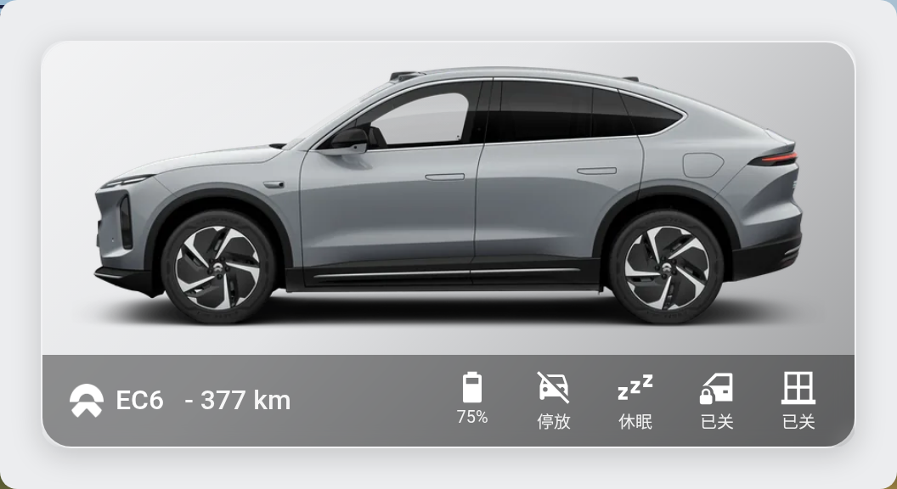

# ha-nio-s

**简体中文** | [English](README.en.md)

把 **蔚来（NIO）** 电动车（EC6 / ES6 / ES8 / ET5 / ET7 …）接入 Home Assistant 的自定义集成，
基于蔚来 iOS App 同款的私有 API。蔚来没有官方 HA 集成——这个集成给你电量、续航、门窗、
驾驶状态、座椅加热、离车模式、实时地图位置（GCJ-02 → WGS-84 已矫正，国内不偏移），还能
**可选**接入换电 / 服务订单历史。

## 功能一览

- **车辆状态**：电量、续航、车辆状态、充电、温度、里程、胎压、固件等
- **门窗安全**：车门 / 车窗 / 车锁 / 前备箱 / 尾门 / 充电口逐项状态
- **告警汇总**：把门窗未关、未上锁、低电量、离线、维保等汇成一个 `告警` 实体（可直接做通知）
- **座椅加热 / 通风、离车模式**：方向盘加热、座椅加热、宠物 / 露营 / 守卫模式等
- **实时位置**：device_tracker，坐标已矫正，HA 地图显示真实位置，重启存活
- **换电 / 服务订单（可选）**：换电次数、累计花费、平均花费、灵活升级、最近订单时间
- **自带 Lovelace 卡片**：NIO Car Card，自动注册、可视化编辑、零前端依赖

## 两类配置（分两次添加）

车辆状态和换电记录走**不同的 API**，因此分两次添加，互不影响：

1. **车辆状态**（必选，可单独使用）
2. **换电 / 服务订单**（可选）

每条配置各自有独立的 Token、刷新频率和「立即刷新」按钮。

## 实体

### 车辆（第一次添加）

| 平台 | 实体 |
| --- | --- |
| `sensor` | 电量 %、续航(CLTC)、续航(实际)、续航达成率、满电续航、电池包类型、车辆状态、充电状态、充电功率、车内/外温度、总里程、方向盘加热、前/后排座椅加热、座椅通风、维保提醒、连续用车天数、告警数、胎压 ×4（诊断）、固件版本（诊断） |
| `binary_sensor` | 驾驶、睡眠、车门、车窗、车锁、充电、前备箱、尾门、充电口、空调、存在告警、电量极低、电量偏低、待维保、服务端告警、宠物 / 离车不下电 / 露营 / 守卫 / 远程查看模式、云端连接 / ADC / CDC（诊断） |
| `device_tracker` | 车辆位置（WGS-84，走实体注册表——重启存活） |
| `button` | 数据刷新（立即拉一次） |

`告警`（`sensor.*_alerts`）的状态是「需关注的告警条数」，属性 `items` 里是完整告警列表
（标题、详情、级别），可直接用于自动化或卡片展示。

轮询是自适应的，对私有 API 比较友好（刷太狠会被限流甚至导致 token 失效）：驾驶中
每 5 分钟、白天每 15 分钟、夜间每 30 分钟。所有间隔都能在集成选项里改。

### 换电 / 服务订单（第二次添加，可选）

| 平台 | 实体 |
| --- | --- |
| `sensor` | 服务订单总数、换电完成次数、换电取消次数、换电累计花费、换电平均花费、灵活升级完成次数、灵活升级累计花费、最近服务订单时间 |
| `button` | 刷新服务订单 |

默认每 60 分钟拉取一次，可在集成选项里改。

## Lovelace 卡片

集成自带一张卡片 —— **NIO Car Card**，并且**自动注册**（不用手动加 Lovelace 资源、
不用额外装任何 HACS 前端插件）。集成加载后，它直接出现在「添加卡片」列表里。

卡片显示你车型的官方渲染图、一条毛玻璃状态栏（标题 + CLTC 续航）、5 个状态图标
（电量 / 驾驶 / 睡眠 / 车门 / 车窗，门窗没关会红色告警），点一下弹出完整状态弹窗 +
数据刷新按钮。

一切都在**可视化编辑器**里设置 —— 选车（NIO 设备）、车型、车身颜色全是点色卡，不用写 YAML：

| 选项 | 作用 |
| --- | --- |
| 车辆 | 选 NIO 设备——实体按设备注册表反查，改了实体 id 也照样能用 |
| 车型 / 颜色 | 选打包的渲染图；多个车型，每个车型全部官方配色 |
| 名称 | 卡片标题（默认 `NIO <车型>`） |
| 背景颜色 | 透明车图背后的影棚底色 |
| 背景渐变质感 | 左上亮 → 右下暗的影棚光泽（默认开） |
| 底栏颜色 / 不透明度 | 状态栏颜色与透明度；图标/文字颜色按对比度自动反色 |
| 显示文字 | 每个图标下方的状态文字；开了底栏会自动变高、车图随之缩放绝不被挡 |
| 背景图片 URL | 可选——用你自己的图盖过背景颜色 |

零前端依赖：弹窗、样式、编辑器全部自包含（不需要 `card_mod` / `browser_mod` /
`streamline-card`）。想用纯 YAML 的人，[`lovelace/`](lovelace/) 里有一份
`picture-glance` 占位符版本。

> [!NOTE]
> 车辆渲染图是厂商官方的宣传/配置器图片，为方便起见打包进来并做了裁切/羽化处理。
> 版权归蔚来公司所有，本项目不主张任何权利。

## 安装

### HACS（自定义存储库）

1. HACS → 集成 → ⋮ → *自定义存储库*
2. 添加 `https://github.com/real3841/ha-nio-s`，类型选 *Integration*
3. 安装 **NIO**，重启 Home Assistant

### 手动

把 `custom_components/nio/` 拷进你 HA 的 `config/custom_components/`，然后重启。

## 配置：车辆状态

集成通过「重放 App 自己的请求」来认证，所以需要抓一次包：

1. 在手机和网络之间架一个 MITM 代理（mitmproxy / Reqable / Charles / Surge / Quantumult X…），
   信任它的 CA 证书。
2. 打开蔚来 App，下拉刷新车辆页。
3. 找到这条请求：
   `https://icar.nio.com/api/2/rvs/vehicle/<vehicle_id>/status?...`
4. 取两样东西：
   - **整条请求 URL**（从 `https://…/status?` 一直到末尾的 `…&sign=…`，复制全部）
   - token —— `Authorization: Bearer …` 请求**头**
5. 在 HA：*设置 → 设备与服务 → 添加集成 → NIO → 车辆状态*，把整条 URL 粘进「状态请求 URL」框、
   token 粘进 Token 框、填上车型即可。

> [!IMPORTANT]
> **请勿改动那条 URL**。服务端的 `sign` 覆盖了整条查询串（字段列表+顺序、`app_ver`、
> `device_id`、`timestamp` 全在内），且这些会随 App 版本漂移（如 6.6.0 新增了 `field=key`、
> `app_ver` 也因人而异）。集成把你抓到的 URL **逐字节原样重放**，所以不要逐字段重拼。
> 抓到的 `sign` 不校验新鲜度，一次抓取可长期使用。URL 与 token 存在 HA 的加密配置存储里（无明文 YAML）。

> [!WARNING]
> Bearer token 是你蔚来账号的会话凭证——当密码看待。这个集成是**只读**的（从不发
> 控制指令），但 token 本身在别处足以远程控制车辆。

token 早晚会过期，到时 HA 会弹出「重新认证」通知——重新抓一个新 token 填进去即可，
不用重启。若提示是**签名被拒**（多半因 App 升级），顺手再粘一条新抓的 URL 刷新即可。

## 配置：换电 / 服务订单（可选）

换电记录用的是另一个接口（`gateway-front-external.nio.com/.../serviceOrder/getTabOrder`），
通常用 **Postman 复制完整请求** 最方便：

1. 在 Postman（或抓包工具）里准备好 getTabOrder 请求，确认 **Params 里的全部参数齐全**
   （`limit`、`orderTypes`、`region` 等），点 **Send** 能返回订单列表。
2. 复制：
   - **完整 URL**（含 `?` 后面的全部 query 参数）
   - **Bearer token**（Authorization 标签页）
3. 在 HA：*添加集成 → NIO → 换电 / 服务订单*，填：
   - **getTabOrder 请求 URL**
   - **Bearer Token**
   - **HTTP 方法**（默认 `POST`，Body 为空）
   - **Cookie / User-Agent / mobileinfo**：可选，多数 Postman 抓包不需要，留空即可

> [!TIP]
> 若所有换电传感器都是 0，多半是 **URL 没粘全**（漏了 `?` 后面的参数）或 **Token 不一致**。
> 打开 `服务订单总数` 传感器，看属性：
> - `api_result_code` 是否为 `0000`（请求成功）
> - `http_status` 是否为 `200`、`http_method` 是否为 `POST`
> - `raw_order_count` 是否大于 0（接口返回的订单条数）
> - `swap_order_count` 为换电订单条数（`服务订单总数` 含维保等全部类型）
>
> 也可点 **刷新服务订单** 按钮后立即查看；或在 `configuration.yaml` 开启
> `custom_components.nio.change_api: debug` 后看 HA 日志。

## 注意事项

- **坐标矫正**：API 返回的位置是 GCJ-02（中国大陆强制加密）。device_tracker 在内部用
  标准 7 参数法转成 WGS-84，所以 HA 地图显示真实位置。
- **门窗语义**已在真车 EC6 上实测（每个开口逐个开合、跟原始 API 抓包 1:1 对照）：
  `*_ajar_status` `1`=关、`0`=开；`vehicle_lock_status` `1`=锁、`0`=解锁；车窗
  `win_*_posn`（`0`=关、`>0`=开）。如果你的车报值不一样，欢迎带上 `door_status` 原始数据开 issue。
- **告警**：`sensor.*_alerts` 已内置门窗 / 上锁 / 低电量 / 离线 / 维保 / 守卫模式等规则，
  无需自己写模板；想触发通知，直接监听它即可。

## 致谢

本项目基于 **[genelee26](https://github.com/genelee26/ha-nio)** 的 ha-nio 集成扩展而来，
感谢原作者把散装 YAML 方案做成了完整的 HACS 集成，并开源了 Lovelace 卡片与抓包重放方案。

最初的思路 —— 抓蔚来 App 的私有 API、把数据喂进 Home Assistant —— 来自 **pangjian**
2022 年在瀚思彼岸论坛发的那篇
[《蔚来接入HA 抛砖引玉》](https://bbs.hassbian.com/thread-17594-1-1.html)。谢谢 pangjian 抛的砖。🙏

## 免责声明

与蔚来公司（NIO Inc.）无任何关联。使用的是未公开的私有 API，随时可能变动或失效，
风险自负。
